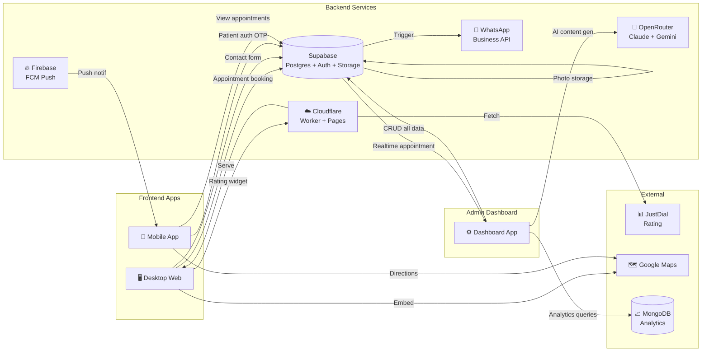
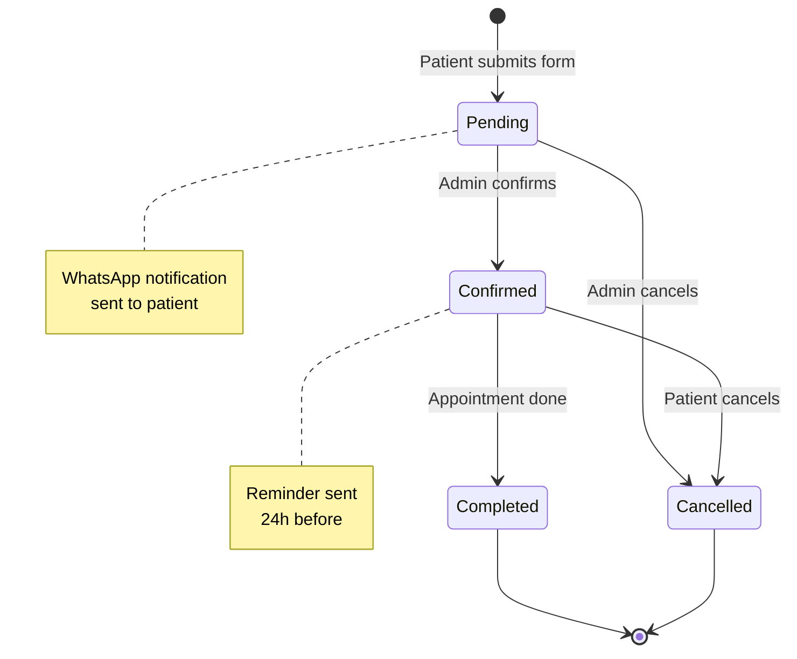
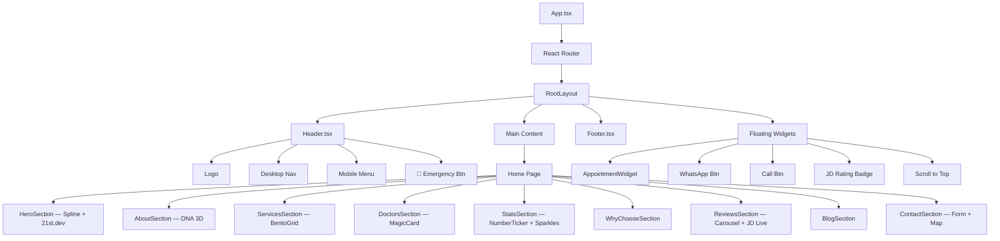

# DIVYAM HOSPITAL — BUILD WORKFLOW DIAGRAM

```mermaid
flowchart TD
    START([🚀 AntiGravity Receives ZIP]) --> LOAD_SKILLS

    subgraph INIT["🔧 PHASE 0: INITIALIZATION"]
        LOAD_SKILLS[Read All Skill Files] --> READ_PRD[Parse PRD_DIVYAM_HOSPITAL.md]
        READ_PRD --> LOAD_CONFIG[Load SITE_CONFIG brand data]
        LOAD_CONFIG --> SETUP_MONO[Create pnpm Monorepo Structure]
        SETUP_MONO --> RUN_MIGRATIONS[Run Supabase DB Migrations]
        RUN_MIGRATIONS --> SEED_DB[Seed All Content to DB]
        SEED_DB --> DEPLOY_CF[Deploy Cloudflare Rating Worker]
    end

    subgraph WEB["🖥️ PHASE 2: DESKTOP WEB APP (apps/web/)"]
        SCAFFOLD_WEB[Scaffold React + Vite + TypeScript] --> INSTALL_21ST[Install 21st.dev Components]
        INSTALL_21ST --> INSTALL_SPLINE[Setup Spline + Three.js]
        INSTALL_SPLINE --> BUILD_LAYOUT[Build Header + Footer]
        BUILD_LAYOUT --> BUILD_HERO[Hero: Spline 3D + MorphingText + Particles]
        BUILD_HERO --> BUILD_SECTIONS[Build All 10 Sections]
        BUILD_SECTIONS --> BUILD_WIDGETS[Floating Widgets: WA + Call + Appt + JD Badge]
        BUILD_WIDGETS --> BUILD_FORMS[Appointment + Contact Forms → Supabase]
        BUILD_FORMS --> BUILD_SEO[React Helmet + Schema.org JSON-LD]
        BUILD_SEO --> LIGHTHOUSE[Lighthouse Audit ≥ 90]
    end

    subgraph MOBILE["📱 PHASE 3: MOBILE NATIVE WEB APP (apps/mobile/)"]
        SCAFFOLD_MOB[Scaffold React + Capacitor] --> BUILD_BOTTOMNAV[Bottom Nav — Material 3, 5 Tabs]
        BUILD_BOTTOMNAV --> BUILD_SCREENS[Build 5 Tab Screens]
        BUILD_SCREENS --> BUILD_AUTH[Patient Auth — Supabase OTP]
        BUILD_AUTH --> BUILD_PWA[PWA Manifest + Service Worker]
        BUILD_PWA --> CAPACITOR[Capacitor Android Config]
        CAPACITOR --> TEST_MOB[Test 375/390/414px widths]
    end

    subgraph DASH["⚙️ PHASE 4: ADMIN DASHBOARD (apps/dashboard/)"]
        SCAFFOLD_DASH[Scaffold React + shadcn/ui] --> BUILD_AUTH_DASH[Supabase Auth Admin Login]
        BUILD_AUTH_DASH --> BUILD_OVERVIEW[Overview KPIs + Recharts]
        BUILD_OVERVIEW --> BUILD_APPT_MGMT[Appointments Calendar + CRUD]
        BUILD_APPT_MGMT --> BUILD_DOCTORS_MGMT[Doctors CRUD + Photo Upload]
        BUILD_DOCTORS_MGMT --> BUILD_CMS[Website CMS — Edit All Sections]
        BUILD_CMS --> BUILD_REVIEWS_MGMT[Reviews Moderation]
        BUILD_REVIEWS_MGMT --> BUILD_BLOG_EDITOR[Blog Editor — TipTap]
        BUILD_BLOG_EDITOR --> BUILD_AI[AI Assistant — OpenRouter]
        BUILD_AI --> BUILD_SETTINGS[Settings + Site Config]
    end

    subgraph INTEGRATION["🔗 PHASE 5: INTEGRATION & QA"]
        TEST_E2E[End-to-End: Book Appt → Dashboard] --> TEST_CMS_SYNC[CMS Change → Frontend Sync]
        TEST_CMS_SYNC --> TEST_REVIEW_SYNC[Review Approved → Frontend Shows]
        TEST_REVIEW_SYNC --> TEST_BLOG_SYNC[Blog Published → Frontend Shows]
        TEST_BLOG_SYNC --> FINAL_AUDIT[Final Lighthouse + SEO Audit]
        FINAL_AUDIT --> CREATE_DOCS[Create INSTALL.md + DEPLOY.md]
        CREATE_DOCS --> PACKAGE_ZIP[Package Final ZIP]
    end

    INIT --> WEB
    INIT --> MOBILE
    INIT --> DASH
    WEB --> INTEGRATION
    MOBILE --> INTEGRATION
    DASH --> INTEGRATION
    PACKAGE_ZIP --> DONE([✅ COMPLETE PLATFORM READY])

    style START fill:#FF6B6B,color:#fff
    style DONE fill:#4ECDC4,color:#fff
    style INIT fill:#1a2035,color:#fff
    style WEB fill:#1a2035,color:#fff
    style MOBILE fill:#1a2035,color:#fff
    style DASH fill:#1a2035,color:#fff
    style INTEGRATION fill:#1a2035,color:#fff
```

---

## DATA FLOW DIAGRAM

```mermaid
graph LR
    subgraph FRONTEND["Frontend Apps"]
        WEB[🖥️ Desktop Web]
        MOB[📱 Mobile App]
    end

    subgraph BACKEND["Backend Services"]
        SB[(Supabase\nPostgres + Auth + Storage)]
        CF[☁️ Cloudflare\nWorker + Pages]
        FB[🔥 Firebase\nFCM Push]
        OR[🤖 OpenRouter\nClaude + Gemini]
        WA[💬 WhatsApp\nBusiness API]
    end

    subgraph DASHBOARD["Admin Dashboard"]
        ADMIN[⚙️ Dashboard App]
    end

    subgraph EXTERNAL["External"]
        JD[📊 JustDial\nRating]
        GMAPS[🗺️ Google Maps]
        MONGO[(📈 MongoDB\nAnalytics)]
    end

    WEB -->|Appointment booking| SB
    WEB -->|Contact form| SB
    MOB -->|Patient auth OTP| SB
    MOB -->|View appointments| SB
    ADMIN -->|CRUD all data| SB
    ADMIN -->|AI content gen| OR
    ADMIN -->|Analytics queries| MONGO

    SB -->|Realtime appointment| ADMIN
    SB -->|Trigger| WA
    SB -->|Photo storage| SB

    CF -->|Fetch| JD
    CF -->|Serve| WEB
    WEB -->|Rating widget| CF

    FB -->|Push notif| MOB

    WEB -->|Embed| GMAPS
    MOB -->|Directions| GMAPS
```

---

## STATE MACHINE: APPOINTMENT LIFECYCLE

```mermaid
stateDiagram-v2
    [*] --> Pending : Patient submits form
    Pending --> Confirmed : Admin confirms
    Pending --> Cancelled : Admin cancels
    Confirmed --> Completed : Appointment done
    Confirmed --> Cancelled : Patient cancels
    Completed --> [*]
    Cancelled --> [*]

    note right of Pending
        WhatsApp notification
        sent to patient
    end note

    note right of Confirmed
        Reminder sent
        24h before
    end note
```

---

## COMPONENT HIERARCHY

```mermaid
graph TD
    APP[App.tsx] --> ROUTER[React Router]
    ROUTER --> LAYOUT[RootLayout]
    LAYOUT --> HEADER[Header.tsx]
    LAYOUT --> MAIN[Main Content]
    LAYOUT --> FOOTER[Footer.tsx]
    LAYOUT --> WIDGETS[Floating Widgets]

    HEADER --> LOGO[Logo]
    HEADER --> DESKNAV[Desktop Nav]
    HEADER --> MOBNAV[Mobile Menu]
    HEADER --> EMERGBTN[🚨 Emergency Btn]

    MAIN --> HOME[Home Page]
    HOME --> HERO[HeroSection — Spline + 21st.dev]
    HOME --> ABOUT[AboutSection — DNA 3D]
    HOME --> SERVICES[ServicesSection — BentoGrid]
    HOME --> DOCTORS[DoctorsSection — MagicCard]
    HOME --> STATS[StatsSection — NumberTicker + Sparkles]
    HOME --> WHY[WhyChooseSection]
    HOME --> REVIEWS[ReviewsSection — Carousel + JD Live]
    HOME --> BLOG[BlogSection]
    HOME --> CONTACT[ContactSection — Form + Map]

    WIDGETS --> APPTWIDGET[AppointmentWidget]
    WIDGETS --> WABTN[WhatsApp Btn]
    WIDGETS --> CALLBTN[Call Btn]
    WIDGETS --> JDBADGE[JD Rating Badge]
    WIDGETS --> SCROLLTOP[Scroll to Top]
```
